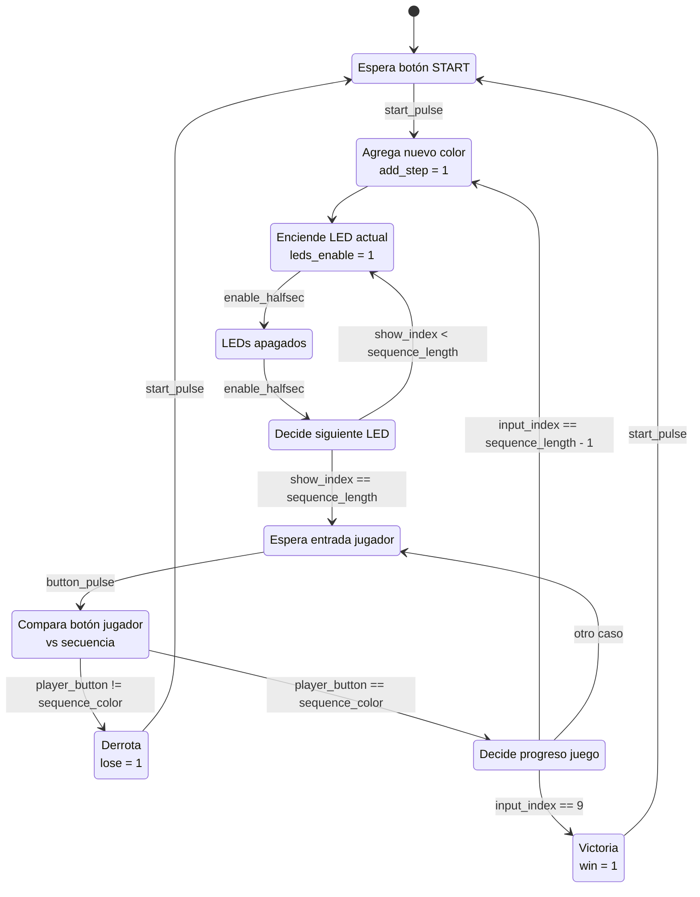

```mermaid
stateDiagram-v2

    [*] --> IDLE

    IDLE : Espera botón START
    IDLE --> NEW_STEP : start_pulse

    NEW_STEP : Agrega nuevo color<br>add_step = 1
    NEW_STEP --> SHOW_LED_ON

    SHOW_LED_ON : Enciende LED actual <br> leds_enable = 1
    SHOW_LED_ON --> SHOW_LED_OFF : enable_halfsec

    SHOW_LED_OFF : LEDs apagados
    SHOW_LED_OFF --> NEXT_SHOW : enable_halfsec

    NEXT_SHOW : Decide siguiente LED

    NEXT_SHOW --> SHOW_LED_ON : show_index < sequence_length
    NEXT_SHOW --> WAIT_PLAYER : show_index == sequence_length

    WAIT_PLAYER : Espera entrada jugador
    WAIT_PLAYER --> CHECK_INPUT : button_pulse

    CHECK_INPUT : Compara botón jugador<br>vs secuencia

    CHECK_INPUT --> LOSE_STATE : player_button != sequence_color
    CHECK_INPUT --> NEXT_INPUT : player_button == sequence_color

    NEXT_INPUT : Decide progreso juego

    NEXT_INPUT --> WIN_STATE : input_index == 9
    NEXT_INPUT --> NEW_STEP : input_index == sequence_length - 1
    NEXT_INPUT --> WAIT_PLAYER : otro caso

    WIN_STATE : Victoria<br>win = 1
    WIN_STATE --> IDLE : start_pulse

    LOSE_STATE : Derrota<br>lose = 1
    LOSE_STATE --> IDLE : start_pulse

```
